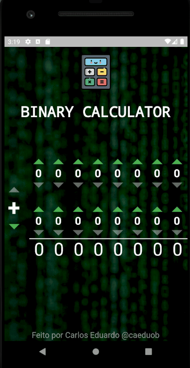

# BINARY CALCULATOR 🖩

This is a simple app that receives two binary numbers of 8 bits and one operation, then it calculates its result value.
## Project demonstration

## Packages that I used
* [flutter_svg](https://pub.dev/packages/flutter_svg):
    Package for helping loading assets of svg
* [awesome_dialog](https://pub.dev/packages/awesome_dialog):
    Package to make easy and beautiful dialogs
## Resources
*   Icons:
    icons providedd from the site [FlatIcon](https://www.flaticon.com/).

## Considerations
App developed by me. You are open to copy or/and use this code for studying as you want.
